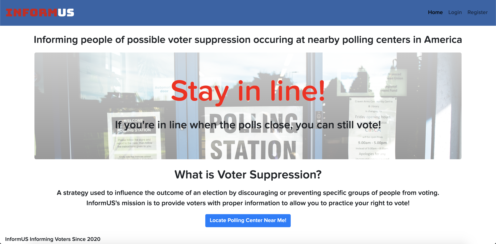
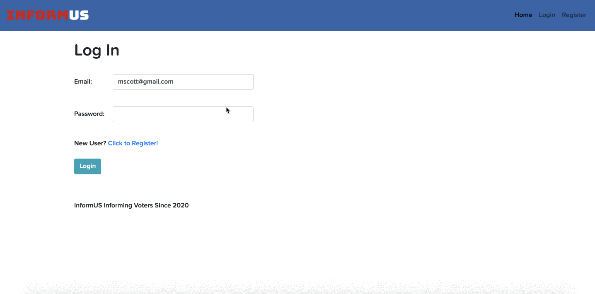

# InformUS
InformUS is a full-stack web application created to inform users of possible voter suppression occuring at nearby polling centers. It allows users to input their address, view nearby polling centers, and leave comments to warn others. 

To watch a screencast of the application go to:

## Overview

**The Map**
* Shows markers representing nearby polling centers.
* Info box includes location's name, hours, and coordinates

**Users can:**
* Login/logout/register (creating an account)
* Find nearest polling centers using any address
* Add a review for a polling center
* View all reviews left by other users for a polling center

## Technologies and stack
**Backend:**
Python, Flask, Flask-SQLAlchemy, Flask-Login, Jinja2

**Frontend:**
JavaScript, jQuery, AJAX, Jijna, HTML5, CSS3, Boostrap

**APIs:**
Google Maps JavaScript, Google Civic Information, Geocode

## Features
**Map**
Google maps methods to initliaze a visual map containing markers for each polling location.
Store comments in a database with associated tables for users, comments, and polling centers
Flask app routes AJAX requests to the database and Flask sessions

**Markers**
Query database to construct a JSON file which supplied my javascript function to populate the map. 
Used Google Maps event listeners to create interactive markers
Click on map marker once to view information about polling center such as name, hours, and location
Click on map marker twice to view comments at the bottom of the page
When logged in, user can leave comment for polling center in the info box 

**Comments**
A logged in user can leave comments for polling centers, when submitted the comment is saved into the database in relation to the user's ID

